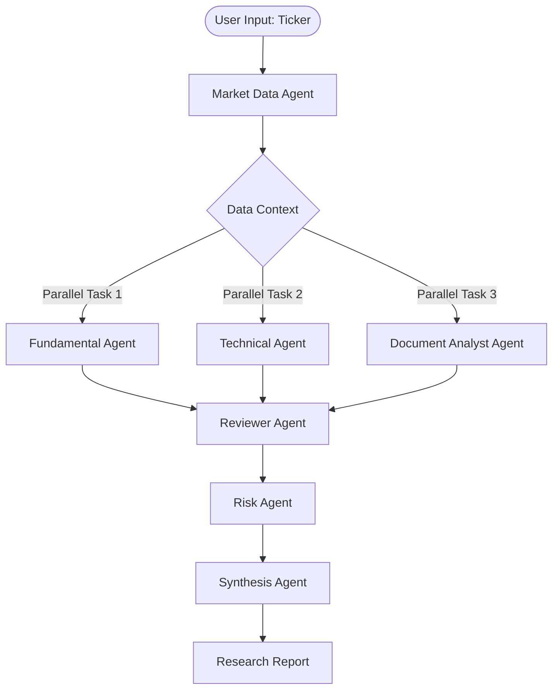

# FAANG Agentic AI Expert Analysis: `agent-financial-analyst`

An institutional-grade review of the architecture, data-flow boundaries, agentic design patterns, and engineering quality of the `agent-financial-analyst` platform.

---

## 📐 System Architecture & Topology

The platform coordinates a multi-agent cluster utilizing a specialized **directed acyclic graph (DAG)** execution pipeline. Rather than relying on a complex, non-deterministic agentic loop (like LangGraph or AutoGen), it enforces a deterministic sequential/parallel layout:



### Key Architectural Strengths

1. **Model Tiering & Cost-Sensitive Routing**:
   - The platform separates cognitively demanding tasks from simpler data parsing/technical checks.
   - High-reasoning agents (Synthesis, Reviewer, Risk, Document, Fundamental) route to `gpt-4o`.
   - Low-reasoning/pattern matching agents (Technical, Market Data) route to `gpt-4o-mini`.
   - **Cost impact**: Reduces execution cost per report to less than **$0.25**, representing a **~90% reduction** compared to running the entire pipeline on `gpt-4o`.

2. **Fault-Tolerant Parallelization**:
   - The triple-analyst deep dive (Fundamental, Technical, Document) is parallelized using `asyncio.gather(*tasks, return_exceptions=True)`.
   - By specifying `return_exceptions=True`, the orchestrator prevents a failure in one sub-agent (e.g., an SEC extraction timeout) from failing the entire run, yielding a graceful degradation of data.

3. **Telemetry & Observability**:
   - OpenTelemetry integration is pre-wired, recording latency spans (`agent_run`, `orchestrate_institutional_research`) across agents.
   - Integrated `loguru` and `structlog` configurations enable institutional-grade audit logs.

---

## 🧬 Agentic Design Patterns

The platform implements several core patterns defined in state-of-the-art agentic AI systems:

| Agent | Design Pattern | Role & Context Delivery |
| :--- | :--- | :--- |
| **Market Data** | Tool-Use (Scraper) | Extracts numerical state via `yfinance` to establish grounding. |
| **Document Analyst** | Tool-Use & Extraction | Pulls specific Item 1A/7 filings from SEC EDGAR URL indices. |
| **Fundamental** | Domain Specialist | Converts raw metrics into institutional valuation discourse. |
| **Technical** | Domain Specialist | Pattern recognition on short-term price channels and RSI. |
| **Reviewer** | **Agentic Critique** | Acts as an MD reviewing junior analysts, checking for bias and missing information. |
| **Synthesis** | Summarization/Thesis | Merges distinct vectors of analysis into a final report. |

### The Critique-Correction Loop

The addition of the **ReviewerAgent** is a classic self-correction loop. The orchestrator dumps the drafts of the junior analysts into the reviewer:
```python
draft_body = f"FUNDAMENTAL: {fundamental}\nTECHNICAL: {technical}\nDOCUMENT: {docs}\nRISKS: {risk_text}"
critique = await self.reviewer_agent.review(draft_body)
```
This critique is then injected into the **SynthesisAgent** alongside the original analyses, forcing the compiler LLM to reconcile opposing views (e.g., strong valuation metrics vs. negative news momentum).

---

## 🛠️ Codebase Health & Crucial Defects

While the modern modular design of the agents is excellent, a detailed inspection reveals **significant architectural drift and runtime-critical bugs** resulting from a partial modernization effort.

### 🔴 Critical Bug: CLI Crash on Pydantic/Dataclass Mismatch
There is a major disconnect between the legacy orchestrator (`FinancialAnalyst` in `agents/__init__.py`) and the modernized orchestrator (`ResearchOrchestrator` in `core/orchestrator.py`):
1. **Schema Drift**: The project has two separate models files:
   - [models.py](file:///C:/Users/Ismail%20Sajid/Downloads/agent-financial-analyst-main/agent-financial-analyst-main/src/agent_financial_analyst/models.py) (Legacy Python dataclasses: includes `agent_outputs`, `total_latency_seconds`, and functions like `.save()`, `.markdown`, `.to_dict()`).
   - [schema/models.py](file:///C:/Users/Ismail%20Sajid/Downloads/agent-financial-analyst-main/agent-financial-analyst-main/src/agent_financial_analyst/schema/models.py) (Modernized Pydantic V2 schemas: includes `agent_traces`, `total_latency_ms`, and strict model constraints).
2. **The CLI Bug**: 
   - [cli.py](file:///C:/Users/Ismail%20Sajid/Downloads/agent-financial-analyst-main/agent-financial-analyst-main/src/agent_financial_analyst/cli.py) imports `ResearchOrchestrator` and the Pydantic `ResearchReport`.
   - The CLI executes `orchestrator.analyze(ticker)` which returns the Pydantic version of `ResearchReport`.
   - However, the CLI then calls:
     ```python
     for a in report.agent_outputs: ... # Error: Pydantic model uses `agent_traces`
     report.total_latency_seconds ...   # Error: Pydantic model uses `total_latency_ms`
     result.save() ...                  # Error: `save()` method is only on legacy dataclass
     result.markdown ...                # Error: `.markdown` property is only on legacy dataclass
     ```
   - **Impact**: Running `agent-analyst report TICKER` will crash immediately on completion.

### 🟡 Mocked Capabilities
- [sec_retrieval.py](file:///C:/Users/Ismail%20Sajid/Downloads/agent-financial-analyst-main/agent-financial-analyst-main/src/agent_financial_analyst/tools/sec_retrieval.py) is a dummy class. It returns hardcoded dates and mock filing texts ("Supply chain disruptions...", "Revenue increased 25%...") for every stock ticker analyzed. It is not currently extracting live SEC EDGAR documents.

---

## 📈 FAANG-Scale Recommendations

To evolve this codebase from a local multi-agent prototype into a high-scale institutional SaaS product:

### 1. Fix the Core Schema Integration
Standardize on the Pydantic V2 schema. Implement serialization/formatting logic as a helper utility class or directly inside the Pydantic models. Deprecate the duplicate dataclass [models.py](file:///C:/Users/Ismail%20Sajid/Downloads/agent-financial-analyst-main/agent-financial-analyst-main/src/agent_financial_analyst/models.py) entirely.

### 2. Implement Real-Time SEC RAG Pipeline
Replace the mock SEC retriever with a production-grade extraction engine:
- Use the official SEC EDGAR Company Filings API.
- Fetch filings using a compliant `User-Agent` (e.g. `YourCompany research-bot@yourcompany.com`).
- Embed a vector database (like Chroma/Qdrant) to chunk and index the MD&A (Management's Discussion & Analysis) and Risk sections.
- Query this database with the agent's research questions instead of passing whole documents which can blow out context windows and costs.

### 3. Dynamic Routing Engine
Replace the fixed orchestrator with a semantic router (e.g., using `SemanticRouter` or simple function calling).
- If analyzing a cryptocurrency, route to a specialized **Crypto Technical Analyst Agent** instead of attempting fundamental evaluation.
- If analyzing a commodity, bypass SEC 10-K extraction entirely.

### 4. Interactive Trace Graph in Dashboard
Since the system tracks internal monologues (`AgentThought`), expose this trace graph as a visual Gantt chart or interactive node system in the React dashboard. This allows institutional users to inspect the exact reasoning sequence of each agent and build confidence in the AI consensus.
